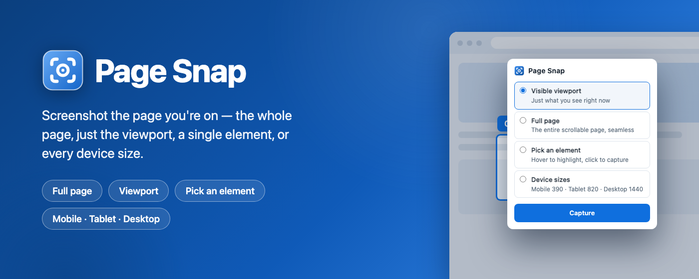
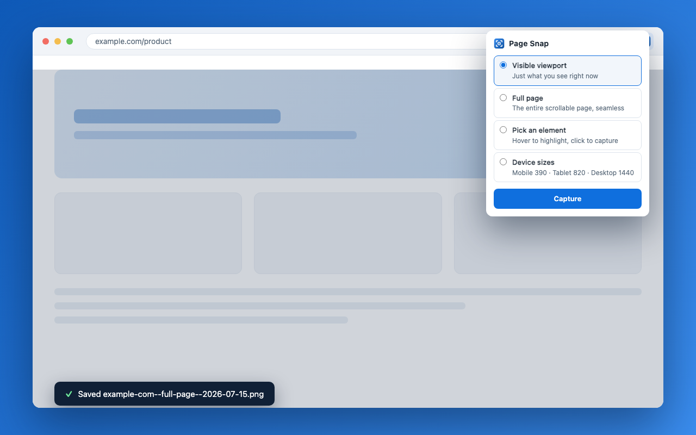

<p align="center">
  
</p>

# Page Snap

A Chrome extension (Manifest V3) that captures screenshots of the page you're
looking at — without leaving the browser. Click the toolbar icon, pick a
mode, and a PNG lands in your downloads.

**Four capture modes:**

- **Visible viewport** — just what's on screen right now
- **Full page** — the entire scrollable page as one seamless image (rendered
  in a single pass via the DevTools Protocol, so no scroll-stitch seams or
  repeated sticky headers)
- **Pick an element** — hover to highlight any element on the page, click to
  capture exactly that box
- **Device sizes** — the same page re-rendered and captured at mobile
  (390px), tablet (820px), and desktop (1440px) widths, genuinely reflowed,
  not scaled

Product page: **[iokig.com/page-snap](https://www.iokig.com/page-snap)**

<p align="center">
  
</p>

## Install

Coming soon to the **Chrome Web Store**.

To run it from source in the meantime:

1. `npm install && npm run build`
2. Open `chrome://extensions`
3. Enable **Developer mode** (top-right toggle)
4. Click **Load unpacked** and select the `dist/` folder

## Use

- Click the extension icon to open the panel
- Pick a mode and hit **Capture**
- Files download automatically as
  `<site>--<mode>--<timestamp>.png` (device captures add the preset name) —
  no save dialogs
- **Pick an element** closes the panel and hands you a highlighter: hover any
  element, click to capture it, or press <kbd>Esc</kbd> to cancel. A ✓ badge
  on the toolbar icon confirms the save.

Full page, element, and device captures briefly attach Chrome's debugger to
the tab (you'll see Chrome's "started debugging" banner during the capture —
it detaches as soon as the file is saved). The quick viewport mode doesn't
need it.

## Privacy

No analytics, no network requests, no data collection. The extension only
runs when you click it, captures only the tab you're on, and writes PNGs to
your downloads folder. Nothing leaves your machine.

## Develop

```
npm install
npm run build       # bundle to dist/
npm run dev         # rebuild on change
npm test            # unit tests (vitest)
npm run test:e2e    # loads the built extension into Chromium (playwright)
npm run lint        # eslint + typecheck
```

## License

[MIT](LICENSE)
